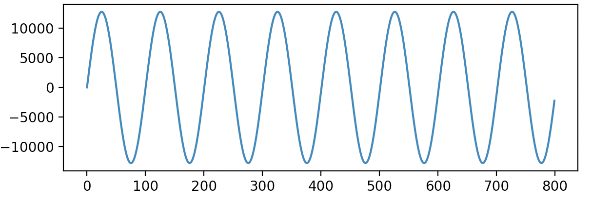
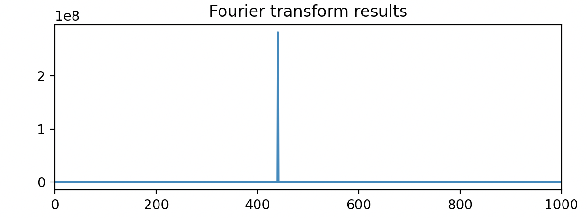
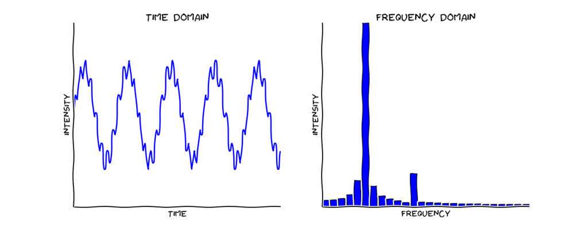
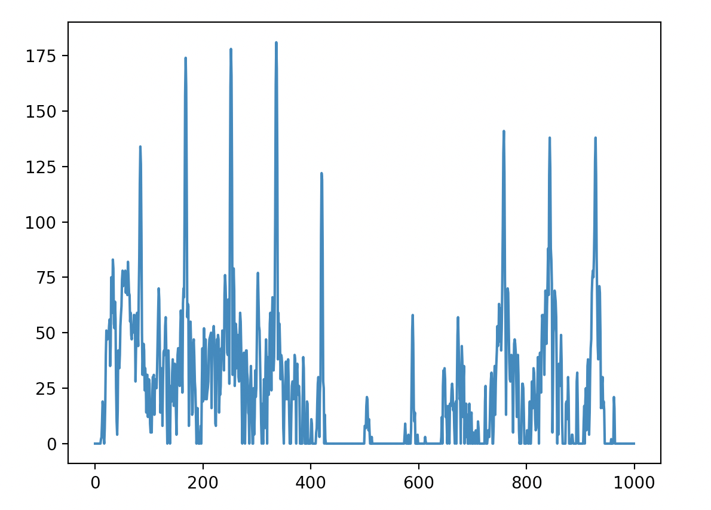
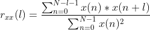
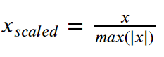

TOC:
- Guitar Basics
- zero crossings
- FFT
  - Basics
  - How to interpret FFT results
- Auto correlation


I recently received some time to work on a passion project of mine.  As a guitar player (perhaps that is a generous description) and a software developer, I have always been interested in attempting to develop a guitar tuner myself.  My goal is to create a simple guitar tuner that works by analyzing a live audio signal via microphone - perfect for a laptop/desktop computer or mobile phone.  This problem touches on numerous different subjects, from music theory, to DSP (digital signal processing), to digital art (a guitar tuner needs to be able to provide visual feedback).  At the heart of any guitar tuner is some sort of pitch detection algorithm.  This post will focus on exploring 3 of those algorithms - zero-crossing, Fast Fourier Transform, and autocorrelation.

## Guitar Basics

Before diving into pitch detection, we need to understand some basics about the guitar.

// TODO: talk about frequencies of six strings, standard tuning, no non-standard tuning - maybe even harmonics? maybe clean vs dirty signals?
// TODO: talk about sine waves? frequency vs amplitude, etc? time domain vs frequency domain?

//TODO pitch is the frequency

// TODO talk about how I don't need to distinguish between octaves (part of goal)

## Zero crossing

//TODO good for getting our feet wet

Perhaps the most basic algorithm that can be considered for pitch detection is commonly called the "zero crossing" method.  As the name implies, this technique works by analyzing an audio signal in the time domain and counting the number of times the amplitude of the wave changes from a positive to a negative value.



Here is a picture of a nice, clean sine wave. With a clean signal we can easily calculate the frequency of the signal. "The frequency of a sine wave is the number of complete cycles that happen every second".  

Frequency is equal to the number of cycles divided by the time (https://www.softschools.com/formulas/physics/frequency_formula/3/#:~:text=Frequency%20is%20the%20number%20of%20cycles%20in%20a%20unit%20of%20time.&text=Frequency%20is%20equal%20to%201,is%20one%20cycle%20per%20second.)


Here is a naive implementation of a zero-crossing algorithm in Javascript.

```
function getNumZeroCrossings (samples) {
  var numZeroCrossings = 0
  for (var i = 1; i < samples.length; i++) {
    if (samples[i] * samples[i - 1] < 0) {
      numZeroCrossings++
    }
  }
  return numZeroCrossings
}

function getNumCycles (numZeroCrossings) {
  return Math.floor((numZeroCrossings - 1) / 2)
}

function calculateFrequency (signalDurationSeconds, numCycles) {
  return numCycles / signalDurationSeconds
}

function start () {
  var signalDurationSeconds = 1
  var arr = [6, 2, -2, -6, -2, 2, 6, 2, -2, -6, -2, 2, 6, 2, -2] //this should be 2 hz
  var numZeroCrossings = getNumZeroCrossings(arr)
  var numCycles = getNumCycles(numZeroCrossings)
  console.log(numCycles)
  var freq = calculateFrequency(1, numCycles)
  console.log(freq + " Hz")
}

```

The zero crossing method of pitch detection is computationally inexpensive and easy to understand.  It works very well for clean audio signals.  Unfortunately clean audio signals are hard to come by while building a guitar tuner, especially when receiving input from a microphone.

//TODO show picture of realistic signal

Upsides:
- computationally inexpensive
- great for clear signals

Downsides:
- vulnerable to noise in signal
- singals are rarely clean

//Sources https://www.mathopenref.com/trigsinewaves.html#:~:text=The%20frequency%20of%20a%20sine,about%20one%20cycle%20per%20second.&text=One%20Hertz%20(1Hz)%20is%20equal%20to%20one%20cycle%20per%20second
The frequency of a sine wave is the number of complete cycles that happen every second.

https://blogs.arubanetworks.com/industries/frequency-cycle-wavelength-amplitude-and-phase/#:~:text=%22An%20oscillation%2C%20or%20cycle%2C,to%20negative%20to%20positive.%22%20%2D
//An oscillation, or cycle, of this alternating current is defined as a single change from up to down to up, or as a change from positive, to negative to positive.


## Fast Fourier Transform

What is a Fast Fourier Transform? According to Wikipedia:

> A fast Fourier transform (FFT) is an algorithm that computes the discrete Fourier transform (DFT) of a sequence, or its inverse (IDFT). Fourier analysis converts > a signal from its original domain (often time or space) to a representation in the frequency domain and vice versa. The DFT is obtained by decomposing a sequence > of values into components of different frequencies.

Ok...so what does that mean? Real-world audio signals are complex and contain a variety of frequency information. For our purposes, the FFT will convert the signal into an set of numbers that we can use to figure out which frequencies are the most prominent in the signal.  Let's take a look at a few pictures to make this more concrete.




We see two images above; a time-domain graph of a clean 440 Hz sine wave, and a frequency-domain graph of the Fast Fourier Transform of that same wave.  Since the signal on the left is a constant 440 Hz, the FFT diagram shows a single spike at 440 Hz.  This data is very easy to interpret.  Let's take a look at a slightly more complex example.


//https://learn.adafruit.com/fft-fun-with-fourier-transforms?view=all

Let's say that this image above shows the time-domain wave of a whistle recorded through a microphone an the Fast Fourier Transoform of that wave.  The time-domain wave is not nearly as clean as the previous example.  How can we detect the pitch of the signal?  There is not a single frequency present in the wave.  By passing this signal through an FFT, however, we can see that there is a particular frequency that is significantly more prominent than the rest.  The peak in FFT shows us what the pitch of the whistle is.  The FFT's ability to divide an audio signal into frequency components make it a powerful technique that is frequently used in audio analysis.  

#### Interpreting FFT output data

After passing a signal through an FFT operation, you will receive back an array of numbers.  Each index of the array is called a _bin_.  You can think of each _bin_ as a bucket for a range of frequencies.  The number in each bin is the amplitude, or "strength" of the frequencies in that bin in the signal.  The higher the amplitude, then the more those frequencies are represented in the signal.  The size of each _bin_, and therefore the range of frequencies that each _bin_ represents, depends on the _resolution_.  

```
resolution = sample_rate / fft_size
```

We can see by the equation that we can increase our resolution by either reducing the `sample_rate` or increasing `fft_size`.  The `fft_size` can be thought of as a buffer that needs to be filled with sound samples.  If we desire increased resolution, we can reduce the `sample_rate`, but it will take longer to fill the buffer.  

To determine which frequencies are in which bin, we can use the following equation:

```
starting_frequency = bin_number * resolution
```

The range of frequencies for a bin would then be from `starting_frequency` to `starting_frequency + resolution`.

For example, if we have a sample rate `48000` and an FFT size of `1024`, then we will have a resolution of `46.875`.  This means that each _bin_ represents a range of freqncies `46.875 Hz` wide.  If we would like to determine the frequencies represented in _bin_ number 12, we can see that the `starting_frequency` will be 562.5.  This means that _bin_ 12 represents the frequencies from 562.5 to 609.375.


#### The importance of resolution

In the above example, we had a resolution of `46.875`.  As we saw the frequency chart in the Guitar Basics section, the difference in frequences between the first two notes on a guitar (where the difference bewteen frequencies is the lowest) are `(F - E)`, or `87.31 Hz - 82.41 Hz = 4.9 Hz`.  The resolution of `46.875` that we achieved with a sample rate of `48000` and an FFT size of `1024` is _not even close_ to giving us enough precision to distinguish between notes.  In addition, according to this https://arxiv.org/pdf/0912.0745.pdf, a trained musician can distinguish differences as small as 0.5 Hz.  In order to decrease our resolution, we need to reduce our sampling rate and/or increase the FFT size.  This comes at the cost of additional computational complexity and more time required to fill the sample buffer, which reduces how real-time the results are.  Achieving a resolution of 0.5 Hz is incredibly non-performant, but we can get decent results with a sampling rate of 48000 and an FFT size of 16384, which gives us a resolution of 2.92.

#### Applying the FFT to a guitar signal

So, given the above information, we should be able to pass audio signal of a guitar string being plucked through an FFT, and look for a spike in the data to figure out the frequency, right?  Let's take a look at an FFT plot of plucking the low E string.



These results are more interesting and complex than the examples given above.  When plucking a guitar's low E string, we get numerous spikes in our plot. These spikes are called harmonics (or overtones).  Harmonics are spikes in frequency at multiples of the _fundamental frequency_ (TODO define this).  Can we simply pick the largest spike in the plot and consider that the frequency?

For a low E string, we are expecting to see a spike at the fundamental frequency of 82.41 Hz - and we do. The problem is that, while this is a significant spike in the data, it is not the largest spike.  This is a common problem when using pitch detection algorithms on audio signals from musical instruments.  Depending on the data, the fundamental frequency may be the first spike, or the second, and so on.  It may be the largest spike and it may not.  Given these problems, how can we reliably detect the pitch?

The best answer is to use a more robust pitch detection algorithm! The FFT, by itself, is simply not the best tool for the job when trying to built a pitch-detecting guitar tuner.  There are some additional techniques that can be used to extract the pitch from FFT output.

#### Making lemonade out of lemons

There are various algorithms and heuristics that can be used on the imperfect data to attempt to get decent results in this scenario.  One of the most well-known methods is called the _Harmonic Product Spectrum_, which will not be covered in this article, but is definitely worth investigating.  

For my demo, I leveraged the fact that harmonics are multiples are the fundamental frequency and the fact that we do not need to distinguish between octaves. 

| E | F | F# | G | G# | A | A# | B | C | C# | D | D# |
|---|---|----|---|----|---|----|---|---|----|---|----|
| 82.41 |	87.31	| 92.50	| 98.00	| 103.8	| 110.0	| 116.5	| 123.5 | 130.8	| 138.6	| 146.8	| 155.6 |

The chart above shows all of the notes on the first accessible octave on a standard-tuned guitar. This method finds the frequency of the largest spike in the data set, and then divides that number of increasingly large integers from `1..n` until the number is smaller than 164.8, which is the frequency of the next octave of E on the guitar.  Then whichever value in the chart the number of closest to will be the estimated note being played.

In practice, in works _okay_ on the higher strings of the guitar, where the difference in frequency between notes is large.  The problems with the FFT's resolution and mean that a more robust algorithm is needed to produce a reliable guitar tuner.

Check it out here: https://jeremygustine.github.io/js-pitch-detection-fft/

Downsides:

- require processing power
- low resolution makes it hard to identify lower notes
- hard to distinguish between harmonics
- hard to identify particular octave

## Autocorrelation

What is autocorrelation? According to Wikipedia:

> Autocorrelation, also known as serial correlation, is the correlation of a signal with a delayed copy of itself as a function of delay. Informally, it is the 
> similarity between observations as a function of the time lag between them. The analysis of autocorrelation is a mathematical tool for finding repeating
> patterns, such as the presence of a periodic signal obscured by noise, or identifying the missing fundamental frequency in a signal implied by its harmonic
> frequencies. It is often used in signal processing for analyzing functions or series of values, such as time domain signals.

In a nutshell, autocorrelation can be used to extract the otherwise difficult-to-recognize repeating patterns within a noisy signal.  The frequency can then be detected by counting the repeating patterns.


#### The equation

When researching autocorrelation methods, the first thing you will discover is that there is not a single definition.  Different disciplines (statistics, finance, digital signal processing, etc.) define the function slightly differently.  The autocorrelation can be calculated on continuous and discrete signals.  We will be using a typical DSP definition for a discrete time signal.



In this equation, `l` represents the `lag`, `x` represents the sequence of data that we will be autocorrelating, and `N` is the number of data points in the sequence.

Most definitions of autocorrelation will include normalization of the data so that the maximum value of the output is scaled to 1.  This is not strictly necessary to design a guitar tuner, but we will normalize the data since this is the classic autocorrelation method, and because it makes visualizing the results easier to reason about.  Many definitions of autocorrelation will use the [_standardization_](https://www.analyticsvidhya.com/blog/2021/05/feature-scaling-techniques-in-python-a-complete-guide/) or [_min-max scaling_](https://www.analyticsvidhya.com/blog/2021/05/feature-scaling-techniques-in-python-a-complete-guide/) methods of normalization, but we will use [_maximum absolute scaling_](https://www.analyticsvidhya.com/blog/2021/05/feature-scaling-techniques-in-python-a-complete-guide/) to normalize our data, so that it is all scaled between -1 and 1.



#### The code


```
function rxx(l, N, x) {
  var sum = 0;
  for (var n = 0; n <= N - l - 1; n++) {
    sum += (x[n] * x [n + l])
  }
  return sum;
}

function autocorrelationWithShiftingLag(samples) {
  var autocorrelation = []
  for (var lag = 0; lag < samples.length; lag++) {
    autocorrelation[lag] = rxx(lag, samples.length, samples)
  }
  return autocorrelation
}

function maxAbsoluteScaling(data) {
  var xMax = Math.abs(Math.max(...data))
  return data.map(x => x / xMax)
}

var audioData = [...] // time domain data collected from microphone
var result = maxAbsoluteScaling(autocorrelationWithShiftingLag(audioData))
```


We want to compare the signal to a time-shifted version of itself.  

- equation
- code
- graphs
- can mention what cross correlation is
- we are trying to measure the similarity between a wave and a time-shifted version of itself
- peak detection algorithm

https://jeremygustine.github.io/js-pitch-detection-autocorrelation/

### Better options

- combination of the above
- That one Greek algorithm
  Still need visual feedback - will investigate canvas element later
  
  
  
  https://ccrma.stanford.edu/~pdelac/154/m154paper.htm
  continuous vs discrete https://www.allaboutcircuits.com/technical-articles/understanding-correlation/
  
  
  Good videos:
  https://www.youtube.com/watch?v=ErtPBvEnQZc&t=724s
  https://www.youtube.com/watch?v=CZetNvqQx_w&t=209s
