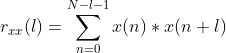

I recently received some time to work on a passion project of mine.  As a guitar player (perhaps that is a generous description) and a software developer, I have always been interested in attempting to develop a guitar tuner myself.  My goal is to create a simple guitar tuner that works by analyzing a live audio signal via microphone - perfect for a laptop/desktop computer or mobile phone.  This problem touches on numerous different subjects, from music theory, to DSP (digital signal processing), to digital art (a guitar tuner needs to be able to provide visual feedback).  At the heart of any guitar tuner is some sort of pitch detection algorithm.  This post will focus on exploring 3 of those algorithms - zero-crossing, Fast Fourier Transform, and autocorrelation.

## Guitar Basics

Before diving into pitch detection, we need to understand some basics about the guitar.

// TODO: talk about frequencies of six strings, standard tuning, no non-standard tuning - maybe even harmonics? maybe clean vs dirty signals?
// TODO: talk about sine waves? frequency vs amplitude, etc? time domain vs frequency domain?

//TODO pitch is the frequency

## Zero crossing

//TODO good for getting our feet wet

Perhaps the most basic algorithm that can be considered for pitch detection is commonly called the "zero crossing" method.  As the name implies, this technique works by analyzing an audio signal in the time domain and counting the number of times the amplitude of the wave changes from a positive to a negative value.


Here is a picture of a nice, clean sine wave. With a clean signal we can easily calculate the frequency of the signal. "The frequency of a sine wave is the number of complete cycles that happen every second".  

Frequency is equal to the number of cycles divided by the time (https://www.softschools.com/formulas/physics/frequency_formula/3/#:~:text=Frequency%20is%20the%20number%20of%20cycles%20in%20a%20unit%20of%20time.&text=Frequency%20is%20equal%20to%201,is%20one%20cycle%20per%20second.)


Here is a naive implementation of a zero-crossing algorithm in Javascript.

```
function getNumZeroCrossings (samples) {
  var numZeroCrossings = 0
  for (var i = 1; i < samples.length; i++) {
    if (samples[i] * samples[i - 1] < 0) {
      numZeroCrossings++
    }
  }
  return numZeroCrossings
}

function getNumCycles (numZeroCrossings) {
  return Math.floor((numZeroCrossings - 1) / 2)
}

function calculateFrequency (signalDurationSeconds, numCycles) {
  return numCycles / signalDurationSeconds
}

function start () {
  var signalDurationSeconds = 1
  var arr = [6, 2, -2, -6, -2, 2, 6, 2, -2, -6, -2, 2, 6, 2, -2] //this should be 2 hz
  var numZeroCrossings = getNumZeroCrossings(arr)
  var numCycles = getNumCycles(numZeroCrossings)
  console.log(numCycles)
  var freq = calculateFrequency(1, numCycles)
  console.log(freq + " Hz")
}

```

The zero crossing method of pitch detection is computationally inexpensive and easy to understand.  It works very well for clean audio signals.  Unfortunately clean audio signals are hard to come by while building a guitar tuner, especially when receiving input from a microphone.

//TODO show picture of realistic signal

Upsides:
- computationally inexpensive
- great for clear signals

Downsides:
- vulnerable to noise in signal
- singals are rarely clean

//Sources https://www.mathopenref.com/trigsinewaves.html#:~:text=The%20frequency%20of%20a%20sine,about%20one%20cycle%20per%20second.&text=One%20Hertz%20(1Hz)%20is%20equal%20to%20one%20cycle%20per%20second
The frequency of a sine wave is the number of complete cycles that happen every second.

https://blogs.arubanetworks.com/industries/frequency-cycle-wavelength-amplitude-and-phase/#:~:text=%22An%20oscillation%2C%20or%20cycle%2C,to%20negative%20to%20positive.%22%20%2D
//An oscillation, or cycle, of this alternating current is defined as a single change from up to down to up, or as a change from positive, to negative to positive.


## Fast Fourier Transform

What is a Fast Fourier Transform? According to Wikipedia:

> A fast Fourier transform (FFT) is an algorithm that computes the discrete Fourier transform (DFT) of a sequence, or its inverse (IDFT). Fourier analysis converts > a signal from its original domain (often time or space) to a representation in the frequency domain and vice versa. The DFT is obtained by decomposing a sequence > of values into components of different frequencies.

Ok...cool. What does that mean? Real-world audio signals are complex and contain a variety of frequency information. For our purposes, the FFT will convert the signal into an array of numbers that we can use to figure out which frequencies are the most prominent in the signal.  Let's take a look at a few pictures to make this more concrete.


// TODO describe the clean vs fft images above

Based on this (time-domain) sound wave, how can we determine the frequency of the signal.  Well, there isn't a single frequency.  By passing this signal through an FFT, however, we can see that there is a single frequency that is significantly more prominent than the rest.  This is a powerful technique that is frequently used in audio analysis.  So, we should be able to pass audio signal of a guitar string being plucked through an FFT to figure out the frequency, right?  Well...kinda.

//show picture of FFT of a high E guitar string being plucked


Well this is interesting.  When plucking a guitar's high E string, we get numerous spikes in our plot. These spikes are called harmonics (add notes about octaves as well).  

This graph shows one of the problems with using an FFT for pitch detection. When analyzing the audio of any music instrument, we will always receive a series of spikes as shown above. These various spikes are called harmonics (or overtones, or actaves) of the fundamental frequency.  The fundamental frequency is the first spike in the graph.  

Problematically, on a guitar, the first spike may not even be the largest one.

We can, luckily, look at the distance between spikes to decently estimate the fundamental frequency.
We can also leverage the fact that these spikes are multiples of the fundamental frequency to estimate the frequency.
This problem of the FFT may not be a huge problem if we don't care which octave we are playing, but only which note.

// the remaining components are overtones and are multiples of the fundamental's frequency. It is the relative mixture of fundamental and overtones that determines //timbre, or the character of an instrument

Another problem with the FFT is that the resolution of the results is inversely proportional to processing power. Notes on a guitar have less frequency between them at the lower end than the higher end. This means that the resolution of the FFT results may be adequate for higher notes, but not for lower.

//Talk about frequency bins

Conveniently, we don't need to understand the advanced math behind the FFT to be able to use it. Besides, we have enough work on our plate figuring out how to interpret the results for our purposes.


- There are a lot of heuristics that can be used, with varying degrees of success.  Overall, this is not the best method.


How does it work?

resolution depends on FFT length and sampling rate

resolution = (sample rate) / (fft size)
e.g.
46.875 = 48000 / 1024
The resolution is our bin width. That is WAY too big for a guitar tuner.

To find the frequency, find the largest bin.
e.g.
Sample rate = 48000
fft size = 16384
resolution = bin width = 2.92
If you see a spike in bin 55, then do:
frequency = bin * resolution
so, 160.2 = 55 * 2.92

https://jeremygustine.github.io/js-pitch-detection-fft/

Downsides:

- require processing power
- low resolution makes it hard to identify lower notes
- hard to distinguish between harmonics
- hard to identify particular octave

### Autocorrelation

https://jeremygustine.github.io/js-pitch-detection-autocorrelation/

Autocorrelation helps us look for the presence of periodicity in the signal.




We want to compare the signal to a time-shifted version of itself.  

- equation
- code
- graphs
- can mention what cross correlation is
- we are trying to measure the similarity between a wave and a time-shifted version of itself

### Better options

- combination of the above
- That one Greek algorithm
  Still need visual feedback - will investigate canvas element later
  
  
  
  https://ccrma.stanford.edu/~pdelac/154/m154paper.htm
  continuous vs discrete https://www.allaboutcircuits.com/technical-articles/understanding-correlation/
